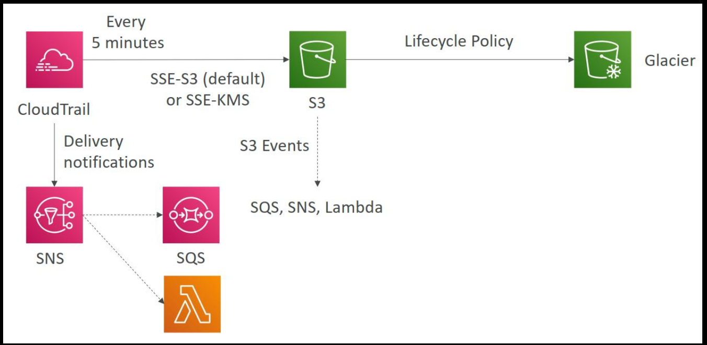

# 🛡️ AWS CloudTrail Fundamentals

> Learn the core concepts of AWS CloudTrail including Event History, Trails, Management Events, Data Events, and CloudTrail Insights.

---

# 📖 Table of Contents

- Event History
- Trails
- Management Events
- Data Events
- CloudTrail Insights
- Event Workflow
- Best Practices

---

# 🎯 Learning Objectives

After completing this chapter, you will be able to:

- Understand CloudTrail Events
- Configure Trails
- Monitor AWS API activity
- Detect unusual account behavior

---

# 📜 Event History

CloudTrail automatically records recent AWS account activities.

Examples:

- Create EC2 Instance
- Delete IAM User
- Upload Object to S3
- Modify Security Group

Event History stores recent management events for quick investigation.

---

# 🛤️ Trails

A Trail continuously records AWS events and delivers them to an Amazon S3 bucket.

Benefits:

- Long-term storage
- Security auditing
- Compliance
- Log analysis

---

# 📋 Management Events

Management Events record operations performed on AWS resources.

Examples:

- Create User
- Launch EC2
- Create VPC
- Modify IAM Policy

These events are enabled by default.

---

# 📦 Data Events

Data Events record operations performed **inside** AWS resources.

Examples:

- Upload object to S3
- Download object from S3
- Invoke Lambda Function

Data Events are optional because they can generate a large number of logs.

---

# 🔍 CloudTrail Insights

CloudTrail Insights detects unusual API activity.

Example:

```text
Normal API Calls

↓

Sudden Increase

↓

CloudTrail Insight Event
```

Benefits:

- Detect suspicious behavior
- Identify operational anomalies
- Improve security monitoring

---

# 🔄 CloudTrail Workflow

```text
User/API Call
      │
      ▼
AWS Service
      │
      ▼
CloudTrail
      │
      ├── Event History
      ├── Amazon S3
      └── CloudWatch Logs
```

---

# ⭐ Best Practices

- Enable a multi-region trail.
- Store logs in a dedicated S3 bucket.
- Protect log files from deletion.
- Enable CloudTrail Insights.
- Integrate with CloudWatch for monitoring.
- Review logs regularly.

---

# 📝 Key Takeaways

- CloudTrail records AWS API activity.
- Event History shows recent management events.
- Trails provide long-term logging.
- Management Events track resource changes.
- Data Events track actions inside resources.
- CloudTrail Insights detects unusual activity.

---

# 🚀 Next Chapter

**02-cloudtrail-security-auditing.md**

Topics Covered:

- Log File Integrity
- Encryption
- CloudWatch Integration
- SNS Notifications
- Security Best Practices
- Compliance
