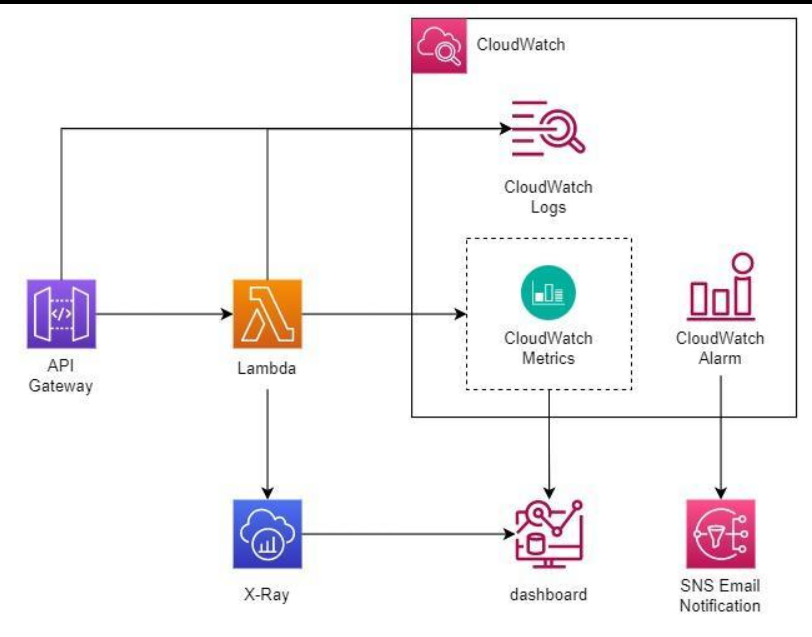

# 🚀 AWS Lambda Advanced Concepts

> Learn advanced AWS Lambda features including Layers, Versions, Aliases, Concurrency, Error Handling, Dead Letter Queues (DLQ), and Monitoring.

---

# 📖 Table of Contents

- Lambda Layers
- Versions
- Aliases
- Concurrency
- Dead Letter Queue (DLQ)
- Error Handling
- Monitoring
- Best Practices
- Key Takeaways

---

# 🎯 Learning Objectives

After completing this chapter, you will be able to:

- Reuse code with Lambda Layers
- Deploy multiple function versions
- Route traffic using Aliases
- Manage Lambda concurrency
- Handle failed executions
- Monitor Lambda performance

---

# 📦 Lambda Layers

Lambda Layers allow you to share common code, libraries, and dependencies across multiple Lambda functions.

### Example

```text
             Lambda Layer
      (Libraries / Dependencies)
                 │
        ┌────────┼────────┐
        ▼        ▼        ▼
    Lambda-1  Lambda-2  Lambda-3
```

### Benefits

- Reusable code
- Smaller deployment packages
- Easier maintenance

---

# 🏷 Versions

Each published Lambda version is **immutable**.

Example:

```text
Version 1
     │
Version 2
     │
Version 3
```

Benefits:

- Safe deployments
- Rollback support
- Version tracking

---

# 🔀 Aliases

Aliases provide a friendly name that points to a Lambda version.

Example:

```text
Production → Version 5

Testing → Version 6

Development → $LATEST
```

Benefits:

- Easy deployments
- Blue/Green deployments
- Traffic shifting

---

# ⚡ Concurrency

Concurrency defines how many Lambda executions can run at the same time.

### Reserved Concurrency

Guarantees a fixed number of concurrent executions for a function.

### Provisioned Concurrency

Keeps Lambda environments pre-initialized to reduce startup latency.

### Benefits

- Predictable performance
- Reduced cold starts
- Better user experience

---

# 📮 Dead Letter Queue (DLQ)

If a Lambda function fails after multiple retry attempts, the failed event can be sent to a Dead Letter Queue.

Supported Services:

- Amazon SQS
- Amazon SNS

Example:

```text
Event

↓

Lambda

↓

Execution Failed

↓

Dead Letter Queue (SQS/SNS)
```

Benefits:

- Prevents data loss
- Easier troubleshooting
- Retry failed events later

---

# ❌ Error Handling

Common error types:

- Timeout
- Permission Denied
- Invalid Input
- Service Errors
- Dependency Failures

Best Practices:

- Validate input
- Handle exceptions
- Configure retries
- Use DLQs

---

# 📊 Monitoring

Monitor Lambda using **Amazon CloudWatch**.

Key Metrics:

- Invocations
- Duration
- Errors
- Throttles
- Concurrent Executions

Logs generated by Lambda are automatically stored in CloudWatch Logs.

---

# 🏗 Production Architecture

```text
Amazon S3 / API Gateway
           │
           ▼
      AWS Lambda
           │
   ┌───────┼────────┐
   ▼       ▼        ▼
CloudWatch DynamoDB SQS
            │
            ▼
           DLQ
```

---

# ⭐ Best Practices

- Keep functions lightweight.
- Reuse dependencies with Layers.
- Use Versions and Aliases for deployments.
- Configure Reserved Concurrency for critical functions.
- Enable Provisioned Concurrency for latency-sensitive applications.
- Monitor logs and metrics using CloudWatch.
- Configure DLQs for asynchronous workloads.

---

# 📝 Key Takeaways

- Layers help share dependencies.
- Versions enable safe deployments.
- Aliases simplify version management.
- Concurrency controls scaling.
- DLQs capture failed events.
- CloudWatch provides monitoring and logging.

---

# 🚀 Next Module

# 📦 Amazon ECR (Elastic Container Registry)

Topics Covered:

- What is Amazon ECR?
- Private vs Public Repositories
- Docker Images
- Image Push & Pull
- Image Scanning
- Lifecycle Policies