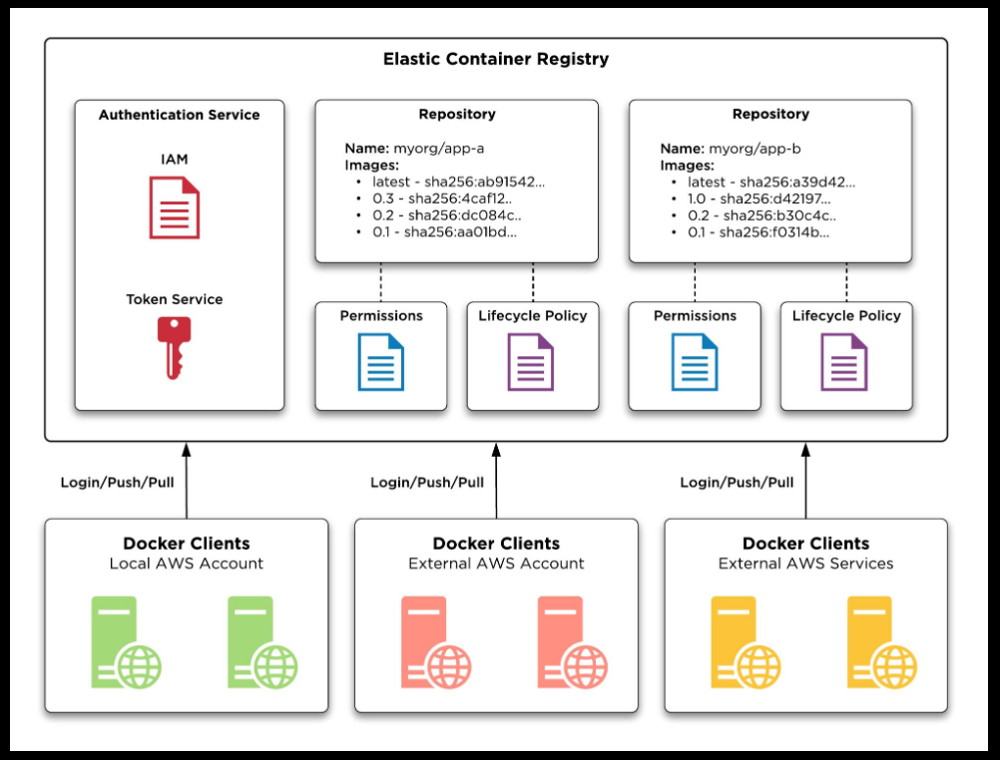

# 📦 Amazon ECR Fundamentals

> Learn the core concepts of Amazon ECR including repositories, Docker images, authentication, image push & pull, and ECR workflow.

---



# 📖 Table of Contents

- Repository
- Private vs Public Repositories
- Docker Images
- Authentication
- Push Image
- Pull Image
- Workflow
- Best Practices

---

# 🎯 Learning Objectives

After completing this chapter, you will be able to:

- Create an ECR Repository
- Authenticate Docker with ECR
- Push Docker Images
- Pull Docker Images
- Understand the ECR workflow

---

# 📁 Repository

An ECR Repository stores Docker container images.

Example:

```text
my-app-repository
├── v1.0
├── v1.1
├── latest
└── dev
```

Each image version is identified using a **tag**.

---

# 🌍 Private vs Public Repository

| Feature | Private ECR | Public ECR |
|----------|-------------|------------|
| Visibility | Private | Public |
| Authentication | Required | Optional |
| Best For | Company Applications | Open Source Projects |

---

# 🐳 Docker Images

A Docker image contains:

- Application Code
- Runtime
- Dependencies
- Libraries
- Configuration

Example:

```text
Dockerfile

↓

docker build

↓

Docker Image

↓

Amazon ECR

↓

Amazon ECS / Amazon EKS
```

---

# 🔐 Authentication

Before pushing or pulling images, Docker must authenticate with Amazon ECR.

Authentication Flow:

```text
AWS CLI

↓

Authentication Token

↓

Docker Login

↓

Amazon ECR
```

---

# ⬆️ Push Image

Workflow:

```text
Build Docker Image

↓

Tag Image

↓

Login to ECR

↓

Push Image

↓

Stored in Repository
```

---

# ⬇️ Pull Image

Workflow:

```text
ECS / EKS

↓

Pull Image

↓

Run Container
```

---

# 🏗 Complete Workflow

```text
Developer

↓

Docker Build

↓

Amazon ECR

↓

Amazon ECS / EKS

↓

Running Containers
```

---

# ⭐ Best Practices

- Use meaningful image tags.
- Avoid relying only on the `latest` tag.
- Store one application per repository when practical.
- Remove unused images regularly.
- Use IAM for repository access.
- Enable image scanning.

---

# 📝 Key Takeaways

- ECR stores Docker images securely.
- Repositories organize container images.
- Images can be private or public.
- Docker authenticates before pushing or pulling images.
- ECR integrates directly with ECS and EKS.

---

# 🚀 Next Chapter

**02-ecr-security-lifecycle.md**

Topics Covered:

- Image Scanning
- Encryption
- Lifecycle Policies
- IAM Permissions
- Cross-Region Replication
- Best Practices