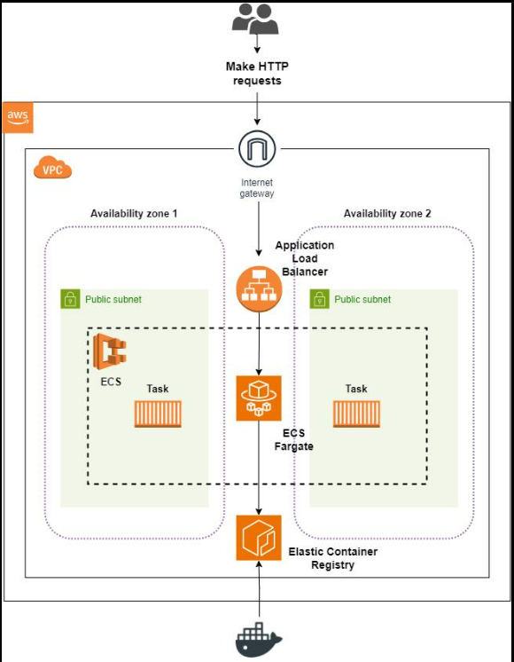

# 🚢 Amazon ECS Fundamentals

> Learn the core concepts of Amazon ECS including Clusters, Task Definitions, Tasks, Services, and Launch Types.

---



# 📖 Table of Contents

- ECS Cluster
- Task Definition
- Task
- Service
- Launch Types
- ECS Workflow
- Best Practices

---

# 🎯 Learning Objectives

After completing this chapter, you will be able to:

- Understand ECS architecture
- Create Task Definitions
- Deploy Tasks and Services
- Choose the right launch type

---

# 🏗 ECS Cluster

An ECS Cluster is a logical group where your containers run.

A cluster can contain:

- EC2 Instances
- AWS Fargate Tasks

---

# 📄 Task Definition

A Task Definition is like a blueprint for your container.

It defines:

- Docker Image
- CPU
- Memory
- Ports
- Environment Variables
- IAM Role

Example:

```text
Docker Image
CPU = 512
Memory = 1024 MB
Port = 80
```

---

# ▶️ Task

A Task is a running instance of a Task Definition.

Example:

```text
Task Definition

↓

Running Task
```

---

# ⚙️ Service

An ECS Service ensures the required number of Tasks are always running.

If one Task stops unexpectedly, ECS automatically starts a new one.

Example:

```text
Desired Tasks = 3

Running:
Task 1
Task 2
Task 3

↓

Task 2 Fails

↓

ECS launches a new Task
```

---

# 🚀 Launch Types

## EC2 Launch Type

- You manage EC2 instances.
- More control over infrastructure.
- Lower cost for predictable workloads.

## AWS Fargate Launch Type

- No server management.
- Pay only for resources used.
- Easier to operate.

---

# 🏗 ECS Workflow

```text
Docker Image

↓

Amazon ECR

↓

Task Definition

↓

ECS Cluster

↓

ECS Service

↓

Running Containers
```

---

# ⭐ Best Practices

- Store images in Amazon ECR.
- Use Fargate for serverless containers.
- Use Services instead of standalone Tasks.
- Store secrets securely.
- Monitor containers with CloudWatch.

---

# 📝 Key Takeaways

- ECS runs Docker containers on AWS.
- Clusters host Tasks.
- Task Definitions define container configuration.
- Services maintain the desired number of Tasks.
- ECS supports both EC2 and Fargate launch types.

---

# 🚀 Next Chapter

**02-ecs-networking-scaling.md**

Topics Covered:

- ECS Networking
- Load Balancer Integration
- Service Discovery
- Auto Scaling
- Rolling Updates
- Monitoring